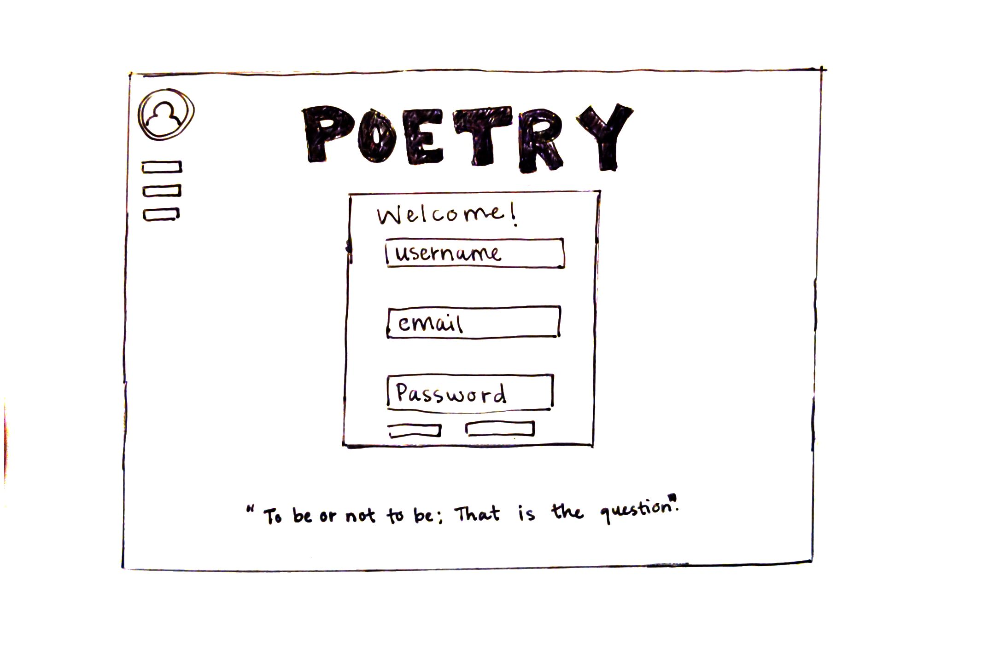

# Startup
### Public Repository for Web Programming Class (CS260)

Poetry is a powerful way to communicate with others. It helps us find meaning and purpose in our shared experiences. The Poetry Website will be a great tool for anyone looking for free and easy access to poetry. All the user has to do is create a free profile and save their favorite poetry to their account. Users will be able to access and save any poem on the website so they can access it later. 

Key Features
* Secure User Account
* Free Access to Poetry
* Ability to Save Poems
* Poetry Browse 
* Fun Daily Quote

### Things I've Learned:
* I learned all about deployment scripts and how powerful they can be
* I learned about html and how to structure an html file properly
* I learned how to deploy local files to remote web server
* I learned about HTML and how to create basic HTML structures
* I learned about CSS and the powerful Bootstrap framework 
